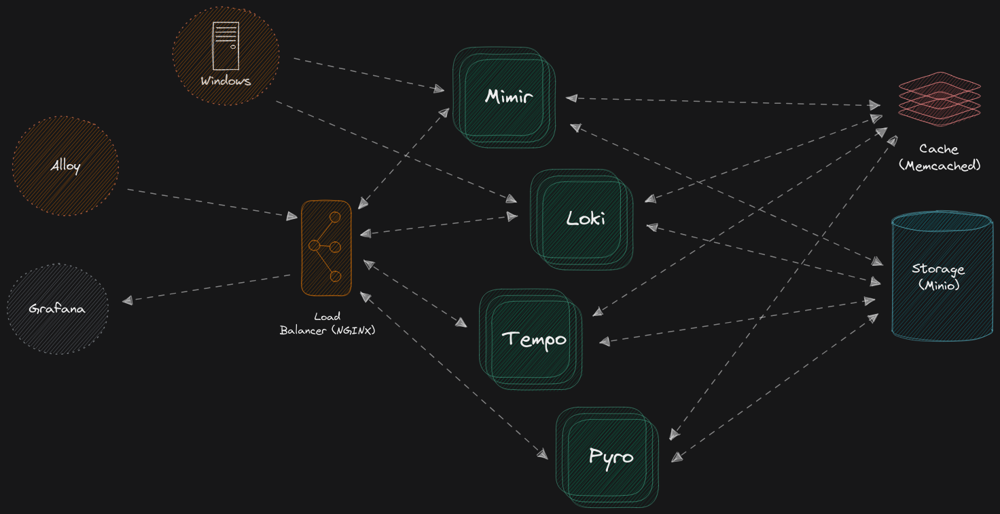

# Configuración Completa de Monitoreo con Grafana

### Alloy, Grafana, Mimir, Loki, Pyroscope, Tempo, Minio, NGinx



> **NOTA**:
> A partir del 18/05/2026
> 
> Esto ha evolucionado hasta convertirse en una bestia única. Nunca había visto un proyecto de Alloy en GitHub que pueda hacer todas las cosas que puede hacer este.

## Completado / Configuración del Sistema

- [x] Métricas y registros de Windows
- [x] Imágenes del stack principal actualizadas a las etiquetas estables actuales (Alloy, Loki, Tempo, Mimir, Pyroscope, Grafana, Nginx, MinIO) ✅ 2026-05-18
- [x] Servicio ntopng integrado con etiquetas de extracción de Alloy + ruta de puerta de enlace nginx ✅ 2026-05-18
- [x] Módulo de monitoreo de IA y perfil de servicio de exportador de GPU (`gpu`) agregados ✅ 2026-05-18
- [x] Módulo de monitoreo de OPNsense y panel de Grafana de ejemplo agregados ✅ 2026-05-18
- [x] Actualizaciones de paneles, la mayoría de los paneles son completamente funcionales ahora; esto dependerá de tus variables y nombres, por supuesto ✅ 2024-06-18
- [x] Identificado cómo hacer que Loki analice los registros correctamente. El único problema es que varían enormemente de una aplicación a otra, lo que requiere expresiones regulares personalizadas; por ejemplo, ahora puedo analizar registros de *arr (lidarr, radarr, etc.). ✅ 2024-06-18
- [x] Integrar el nuevo [Explore Logs](https://github.com/grafana/explore-logs) / [Vista previa de Grafana 11](https://grafana.com/docs/grafana/latest/whatsnew/whats-new-in-v11-0/) ✅ 2024-06-18
- [x] Actualizar el colector a Alloy
- [x] Alloy configurado como un colector total del sistema
  - [x] Métricas de Docker (cAdvisor integrado en Alloy)
  - [x] Registros de Docker (integrado en Alloy)
  - [x] Métricas de Traefik (integrado en Traefik / Extracción Prom de Alloy)
  - [x] Métricas del sistema local (node exporter)
  - [x] Registros del sistema local (módulo journald)
- [x] Puerta de enlace para Alloy / Grafana
- [x] Esto fue necesario antes de separar Loki y Mimir en modo de lectura/escritura
- [x] Hacer que Pyro y Tempo funcionen correctamente
- [x] Configurar On-Call para que funcione con Slack
- [x] Hacer que las alertas y reglas se integren correctamente en el stack
- [x] Reestructurar configuraciones para utilizar source/target en Docker, esto es importante para cambiar configuraciones, así como para mostrar las configuraciones importantes a quienes están intentando aprender sobre el stack
- [x] MUCHO más, esto fue solo lo que se me vino a la mente

## Por Hacer

- [ ] Ajustar los paneles de ejemplo de IA y OPNsense para nombres de métricas locales
- [ ] Agregar una capa de autenticación endurecida para producción en los endpoints de ntopng/OPNsense
- [ ] Actualizar este readme / guía, hay tantísimas variables que explicar cómo funciona puede resultar complicado
- [ ] Refinar más Alloy para etiquetar correctamente, descartar lo que no necesite, etc.
- [ ] Refinar aún más la filosofía de "módulos" de Alloy, quiero hacerlo tan simple que alguien pueda descargarlo y, con unos pocos clics, tener funcionando lo que necesita
- [ ] Corregir paneles, en modo mono, los paneles no funcionan directamente para Loki y algunos otros; los mixins tampoco parecen resolver los problemas, al menos en mi caso
- [ ] Determinar el mejor método para enviar los registros de Docker a Alloy; no es un problema de Alloy, sino más bien de los contenedores de Docker, ya que no existe un estándar de formato estricto al que todos se ajusten. Por ello, las opciones son hacer que Alloy lo gestione, o quizás enviar todos los registros de Docker a otro lugar para reformatearlos y luego a Alloy
  - [ ] Una idea es enviarlos todos a journald, luego formatearlos desde allí y/o mediante un plugin diferente para registros de Docker
- [ ] Agregar un Exportador / Receptor para Windows
- [ ] Agregar un Exportador / Receptor para nodos Linux
- [ ] Mucho más, ya que mi intención es convertir esto en una solución Todo en Uno que cualquiera pueda usar fácilmente


> [!NOTE]
> Para las métricas de Windows, existen dos formas diferentes de hacerlo. Si usas Windows Exporter, todo funciona perfectamente, registros y métricas. Mi problema es que hacerlo de esa manera no te permite limitar las métricas innecesarias como sí puede Alloy. Hacer que todo el proceso, de principio a fin, sea lo más ligero posible es uno de mis principales objetivos, por lo que luego construí otra configuración de Alloy para usarla de forma remota en una máquina Windows, la cual extraerá solo las métricas necesarias para los paneles. El problema es que, aunque ambos se construyen exactamente igual, por alguna razón ciertas métricas tienen dificultades para aparecer en Grafana, incluso aunque pueda hacer que funcionen manualmente en PromQL. Esto me indica que hay algún problema con las variables del panel, aunque estén configuradas correctamente. 

> [!NOTE]
> Una de las razones principales por las que nunca usé Grafana o el agente anteriormente fue debido al alto consumo de CPU, casi siempre con Loki. Esto se debía a los registros de contenedores y al hecho de que Loki no sabe qué hacer si los usuarios no tienen sus registros recortados y organizados correctamente. Loki seguirá intentando reprocesar los registros antiguos, incluso si tienes configurada una edad máxima, ya que debe escanear los archivos para determinar su antigüedad.......

## \#Guía-de-Instalación

1. Clonar el proyecto desde git:

```shell
git clone https://github.com/acester822/LGTMP.git
```

2. Iniciar el stack

```shell
docker compose up
```

Para incluir métricas de GPU NVIDIA con el exportador DCGM:

```shell
docker compose --profile gpu up
```

Mapeo de puertos predeterminado del stack LGTMP de Grafana

| Mapeo de puertos                  | Componente     | Descripción                                                                                                 |
|-------------------------------|---------------|-------------------------------------------------------------------------------------------------------------|
| `12345:12345`, `4317`, `4318`, `6831` | [Grafana Alloy](https://grafana.com/docs/alloy/latest/) | Exponer el puerto `12345` para acceder directamente a `Alloy` dentro del contenedor                                          |
| `33100:3100`                    | [Loki](https://github.com/grafana/loki)          | Exponer el puerto `33100` para acceder directamente a `loki` dentro del contenedor                                           |
| `3000:3000`, `6060`               | [Grafana](https://github.com/grafana/grafana)       | Exponer el puerto `3000` para acceder directamente a `grafana` dentro del contenedor                                         |
| `33200:3200`, `4317`, `4318`        | [Tempo](https://github.com/grafana/tempo)         | Exponer el puerto `33200` para acceder directamente a `tempo` dentro del contenedor                                          |
| `38080:8080`                    | [Mimir](https://github.com/grafana/mimir)         | Exponer el puerto `38080` para acceder directamente a `mimir` dentro del contenedor                                          |
| `34040:4040`                    | [Pyroscope](https://github.com/grafana/pyroscope)     | Exponer el puerto `34040` para acceder directamente a `pyroscope` dentro del contenedor                                      |
| `9001:9001`, `9000`               | [Minio](https://github.com/minio/minio)         | Exponer el puerto `9001` para acceder a la consola de `minio` con `MINIO_ROOT_USER=lgtmp`, `MINIO_ROOT_PASSWORD=supersecret` |
| `3001:3000`                    | [ntopng](https://github.com/ntop/ntopng)         | Exponer `3001` para la interfaz de ntopng mediante enrutamiento de puerta de enlace nginx |
| `9400:9400`                    | [NVIDIA DCGM Exporter](https://github.com/NVIDIA/dcgm-exporter)         | Endpoint de telemetría de GPU (activado con `--profile gpu`) |

## Configuración de ntopng

1. Iniciar el stack normalmente con `docker compose up`.
2. Abrir ntopng en `http://localhost:3001`.
3. Los datos persistentes se almacenan en el volumen de Docker `ntopng_data`.
4. Alloy extrae las métricas de ntopng desde `ntopng:3000/metrics` (anular con `NTOPNG_METRICS_TARGET` y `NTOPNG_METRICS_PATH`).

## Configuración de monitoreo de IA / LLM

1. Habilitar la extracción de IA en Alloy:
   - `AI_MONITORING_ENABLED=true`
2. Métricas de GPU opcionales:
   - Ejecutar el stack con `--profile gpu` para iniciar `dcgm-exporter`.
3. Establecer destinos de endpoint según sea necesario:
   - `DCGM_EXPORTER_TARGET=dcgm-exporter:9400`
   - `AI_INFERENCE_METRICS_TARGET=<host:port>`
   - `AI_TOKEN_METRICS_TARGET=<host:port>`
   - `LLM_API_METRICS_TARGET=<host:port>`
4. Variables de entorno de ejemplo: `config/alloy/modules/integrations/examples/ai-monitoring-example.alloy`

### Ejemplos de frameworks de IA

- OpenAI API: exportar contadores de latencia y tokens a través del endpoint de Prometheus de tu aplicación y configurar `AI_INFERENCE_METRICS_TARGET`.
- LangChain: habilitar el exportador de callbacks/telemetría, luego extraer el endpoint de la aplicación con `AI_TOKEN_METRICS_TARGET`.
- LlamaIndex: exponer métricas de latencia de consulta + tokens desde el middleware de Prometheus de la aplicación.
- Ollama: extraer el endpoint de métricas compatible con Ollama mediante `LLM_API_METRICS_TARGET`.

## Configuración de integración con OPNsense

1. Habilitar el plugin de exportador Prometheus en OPNsense y exponer el endpoint de métricas.
2. Habilitar el módulo de Alloy:
   - `OPNSENSE_MONITORING_ENABLED=true`
3. Configurar el endpoint del exportador:
   - `OPNSENSE_METRICS_TARGET=<opnsense-host:port>`
   - `OPNSENSE_METRICS_PATH=/metrics` (o ruta personalizada)
4. Variables de entorno de ejemplo: `config/alloy/modules/integrations/examples/opnsense-example.alloy`

El panel de ejemplo de OPNsense incluye métricas de reglas de firewall, tráfico, estado de la puerta de enlace y paneles de salud del sistema.

## Enlaces Útiles

- <https://grafana.com/docs/>
- https://github.com/qclaogui/codelab-monitoring
- <https://github.com/docker/compose>
- <https://grafana.com/docs/agent/latest/flow/reference/components/>
- <https://github.com/grafana/grafana>
- https://grafana.com/docs/alloy/latest/
- https://github.com/grafana/alloy-modules/tree/main
- https://github.com/grafana/explore-logs
