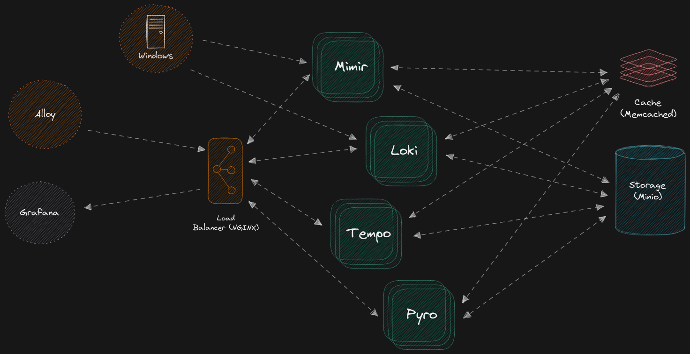

# Complete Grafana Monitoring Setup

### Alloy, Grafana, Mimir, Loki, Pyroscope, Tempo, Minio, NGinx



> **NOTE**:
> As of 6/18/2024
> 
> This has progressed into its own unique beast. I have not seen an alloy before on github that can do all of the things this one can. 

## Done / System Setup

- [x] Windows Metrics and Logs
- [x] Dashboard updates, most dashboards are fully functional now, this will depend on your variables and names of course ✅ 2024-06-18
- [x] Identified how to get loki to parse logs properly. The only issue is they vary so greatly from app to app it requires custom regex, for example I now can parse arr logs (lidarr, radarr, etc). ✅ 2024-06-18
- [x] Integrate new [Explore Logs](https://github.com/grafana/explore-logs) / [Grafana 11 Preview](https://grafana.com/docs/grafana/latest/whatsnew/whats-new-in-v11-0/) ✅ 2024-06-18
- [x] Update collector to Alloy
- [x] Alloy configured as a total system collector
  - [x] Docker Metrics (Alloy cAdvisor built in)
  - [x] Docker Logs (Alloy built in)
  - [x] Traefik Metrics (Traefik built in / Alloy Prom Scrape)
  - [x] Local System Metrics (node exporter)
  - [x] Local System Logs (journald module)
- [x] Gateway for Alloy / Grafana
- [x] This was needed before I split Loki and Mimir into read/write mode
- [x] Get Pyro and Tempo to work properly
- [x] Set up On Call to work with Slack
- [x] Get alerts and rules to pull into the stack properly
- [x] Redo configs to utilize source/target in docker, this is important for switching configurations as well as showing the important configurations to those who are trying to learn the stack
- [x] ALOT more, this was just what was on the top of my head

## Still To Do

- [ ] Update this readme / howto, there are soooooo many variables, that explaining how it works can be tough
- [ ] Further refine Alloy to label properly, drop what it doesn't need, etc
- [ ] Further refine the "module" philosophy of Alloy, I want to make it so simple that someone could download this, and with a few clicks be up and running with what they need
- [ ] Fix Dashboards, in mono mode, dashboards do not work out of the box for Loki and some others, mixins also does not seem to fix the issues, atleast in my case
- [ ] Figure out the best method to get docker logs into Alloy, it is not an Alloy issue, but rather a docker container issue, as there is no rock solid formatting style that everyone conforms to, because of this the options are to make Alloy do it, or perhaps ship all docker logs off to get reformatted elsewhere then to Alloy
  - [ ] One idea is to ship them all to journald, then format from there and / or a different docker logs plugin
- [ ] Add a Windows Exporter / Receiver
- [ ] Add a Linux Node Exporter / Receiver
- [ ] Much more, as I intend to make this an All In One that anyone could easily use


> [!NOTE]
> For Windows Metrics, there are two different ways you can do it. If you use Windows Exporter, everything works perfect, logs and metrics. My issue was that Doing it that way does not allow you to limit the garbage metrics like Alloy can. Making the entire process start to finish as lean as possible is one of my main goals, so I then built another alloy config to use remotely on a windows machine that will pull only the metrics needed for the dashboards. The issue is even though they are both build exactly the same, for some reason random metrics are having a hard time showing up in grafana even though I can manually get them to work in promql. This tells me there is an issue in the dashboard variables somehow even though they are correct. 

> [!NOTE]
> One of the main reasons I never used grafana or the agent before, was because of heavy CPU usage, most always with Loki, this was due to container logs and the fact that Loki has no idea what to do if people, aka its users do not have their logs trimmed and proper. Loki will keep trying to reprocess the old logs, even if you have max age's set as it has to scan the files to see the age.......

## \#How-To-Install

1. Pull project from git:

```shell
git clone https://github.com/acester822/LGTMP.git
```

2. Start it up

```shell
docker compose up
```

Grafana LGTMP Stack default port-mapping

| Port-mapping                  | Component     | Description                                                                                                 |
|-------------------------------|---------------|-------------------------------------------------------------------------------------------------------------|
| `12345:12345`, `4317`, `4318`, `6831` | [Grafana Alloy](https://grafana.com/docs/alloy/latest/) | Expose `12345` port so we can directly access `Alloy` inside container                                          |
| `33100:3100`                    | [Loki](https://github.com/grafana/loki)          | Expose `33100` port so we can directly access `loki` inside container                                           |
| `3000:3000`, `6060`               | [Grafana](https://github.com/grafana/grafana)       | Expose `3000` port so we can directly access `grafana` inside container                                         |
| `33200:3200`, `4317`, `4318`        | [Tempo](https://github.com/grafana/tempo)         | Expose `33200` port so we can directly access `tempo` inside container                                          |
| `38080:8080`                    | [Mimir](https://github.com/grafana/mimir)         | Expose `38080` port so we can directly access `mimir` inside container                                          |
| `34040:4040`                    | [Pyroscope](https://github.com/grafana/pyroscope)     | Expose `34040` port so we can directly access `pyroscope` inside container                                      |
| `9001:9001`, `9000`               | [Minio](https://github.com/minio/minio)         | Expose `9001` port so we can access `minio` console with `MINIO_ROOT_USER=lgtmp`, `MINIO_ROOT_PASSWORD=supersecret` |

## Helpful Links

- <https://grafana.com/docs/>
- https://github.com/qclaogui/codelab-monitoring
- <https://github.com/docker/compose>
- <https://grafana.com/docs/agent/latest/flow/reference/components/>
- <https://github.com/grafana/grafana>
- https://grafana.com/docs/alloy/latest/
- https://github.com/grafana/alloy-modules/tree/main
- https://github.com/grafana/explore-logs
